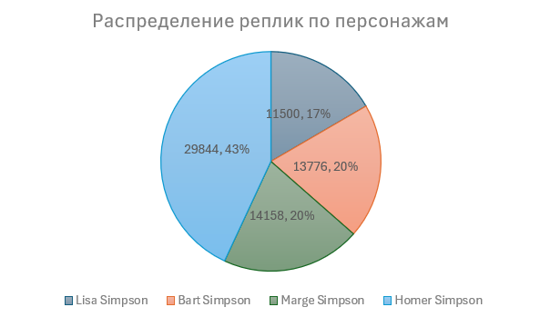
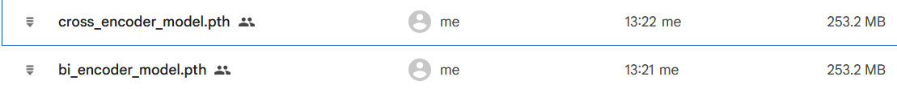
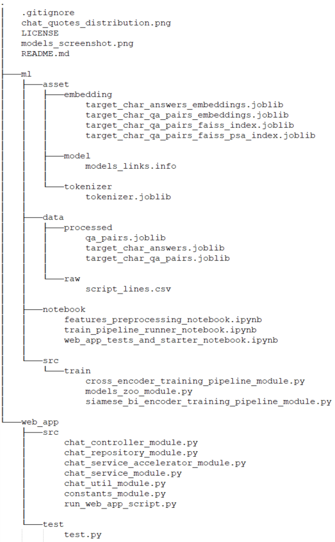
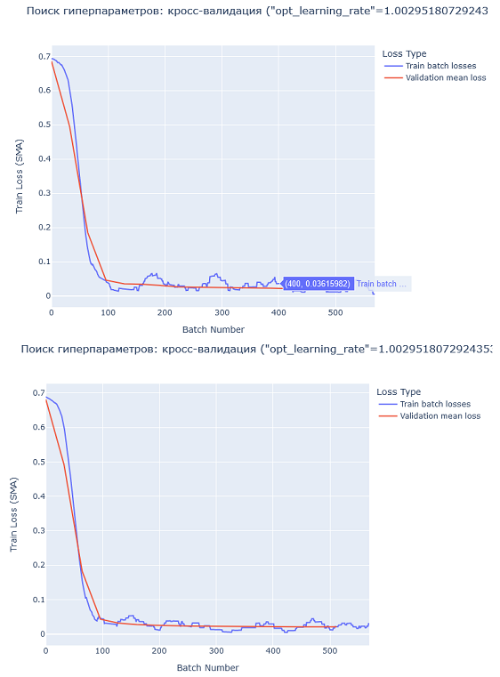
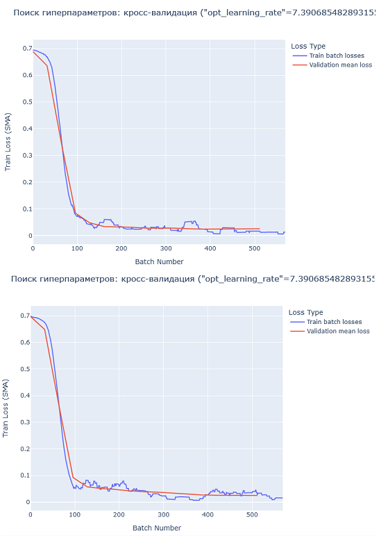
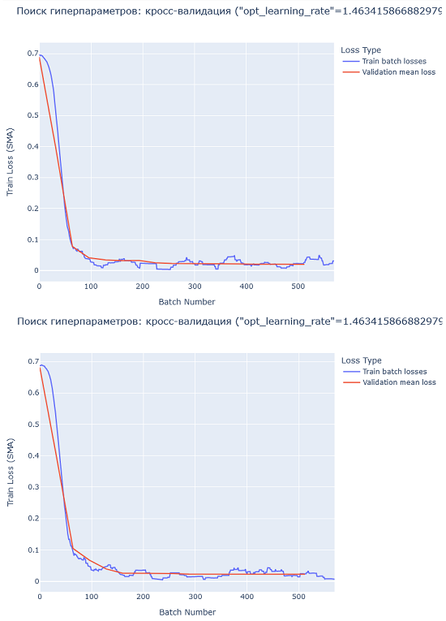
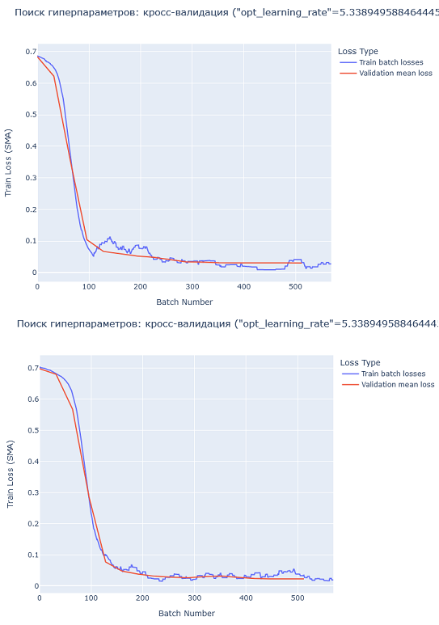
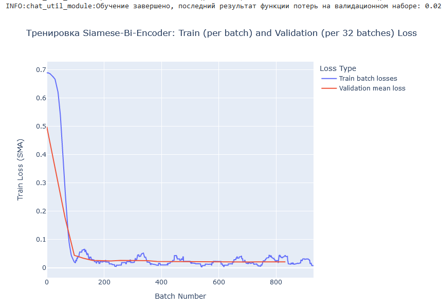
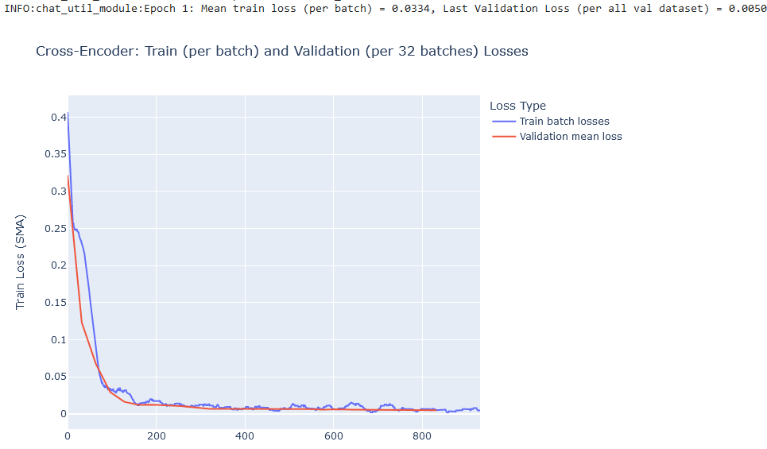

# Отчет о выполнении задания "№1. Разработка Retrieval-Based чат-бота"

## Содержание отчета

1. Описание входных данных ([ссылка](#1-описание-входных-данных))
2. Описание артефактов (выходных файлов) ([ссылка](#2-описание-артефактов))
3. Указание структуры проекта (включая файлы, доступные в GitHub и по ссылкам) ([ссылка](#3-описание-структуры-проекта))
4. Графики обучения и валидации моделей (включая поиск в пространстве гиперпараметров), с комментариями ([ссылка](#4-графики-обучения-и-валидации-моделей))
5. Ссылки на ноутбуки, которые использованы для загрузки исходников проекта и их запуска, со всеми графиками, логами и тестами:
   1. Ноутбук препроцессинга данных
   2. Ноутбук скачивания ML кода с GitHub и запуска обучения и валидации моделей, генерации артефактов
   3. Ноутбук скачивания кода Web-приложения с GitHub, запуска интеграционного тестирования, а также старта приложения
6. Описание использования моделей (классы, методы, ресурсы реализующие логику выдачи ответов)
7. Ускорение вывода, а также итеративный процесс улучшений проекта (опыт, выводы, подходы и методы)

---

## 1 описание входных данных

В качестве входных данных используются диалоги из сериала "The Simpsons".
Можно разделить входные данные на 2 блока: сырые до предобработки в исходном виде, и также данные после обработки.
### 1.1 Описание исходных данных:
- файл по пути *ml/data/raw/script_lines.csv*
- столбцы - id, episode_id, number, raw_text, timestamp_in_ms, speaking_line, character_id, location_id, raw_character_text, raw_location_text, spoken_words, normalized_text, word_count;
- кол-во записей - 158267;
- каждая запись содержит данные полей указанных выше для реплики из сериала;
- распределение реплик по персонажам представлено на диаграмме ниже

- в четверку лидеров входит **Lisa Simpson, именно этот персонаж выбран в качестве роли для чат-бота**;
- наиболее информативным полем является поле raw_text с именем персонажа и репликой, для кросс-проверки данных также использовались другие поля (например, character_id);
### 1.2 Описание предобработанных данных:
- **ml/data/processed** - получены предобработанные файлы:
  - qa_pairs.joblib (данные реплик обогащены тремя предыдущими, сохранена текущая реплика, а также метка принадлежности к целевому персонажу Lisa Simpson);
  - target_char_answers.joblib (аналогично target_char_qa_pairs.joblib, но лишь ответы);
  - target_char_qa_pairs.joblib (аналогично qa_pairs.joblib, но отфильтрованы ответы целевого персонажа, поле контекста сохранено);
- несколько нюансов про предобработку данных - в пункте 7 ("итеративный процесс улучшений");
- по итогам предобработки реплики были обогащены контекстом (предыдущими репликами), причем группировка производилась по эпизоду и локации (например, автомобиль, магазин);
- запуск предобработки производился в ноутбуке (это единственный случай в этом проекте, когда не выделялись классы и модули py, хотя подкачивался файл с постоянными полями).
## 2-описание-артефактов:
- модели по итогам обучения, сохранены в формате pth, ссылки представлены в файле *ml/asset/model/models_links.info*, ниже снимок файлов моделей в хранилище;

- эмбеддинги (siamese-bi-encoder) по пути *ml/asset/embedding*, см. про использование в пункте 6 и 7:
  - *ml/asset/embedding/target_char_answers_embeddings.joblib* (ответы целевого персонажа);
  - *ml/asset/embedding/target_char_qa_pairs_embeddings.joblib* (ответы целевого персонажа и предыдущие реплики, mean_pool);
  - *ml/asset/embedding/target_char_qa_pairs_faiss_index.joblib* (FAISS GPU индекс на основе target_char_qa_pairs_embeddings);
  - *ml/asset/embedding/target_char_qa_pairs_faiss_psa_index.joblib* (FAISS GPU индекс с уменьшением размерности, аналогичен предыдущему);
- токенизатор ('distilbert-base-uncased') по пути *ml/asset/tokenizer/tokenizer.joblib* - для повторяемости вывода.
## 3-описание-структуры-проекта:
- проект состоит из трех основных блоков - ML файлы, файлы Web-приложения, прочие файлы;
- в целом структура проекта отображена на снимке ниже
- 
### 3.1 ML файлы проекта:
- **assets** (артефакты выхода после процессинга), см. пункт 2 выше;
- **notebook** (ноутбуки для подкачки исходных кодов из github репозитория проекта и запуска препроцессинга, тренировки, валидации, тестов и старта приложения;
  - *ml/notebook/features_preprocessing_notebook.ipynb* (ноутбук препроцессинга данных); 
  - *ml/notebook/train_pipeline_runner_notebook.ipynb* (ноутбук скачивания ML кода с GitHub и запуска обучения и валидации моделей, генерации артефактов);  
  - *ml/notebook/web_app_tests_and_starter_notebook.ipynb* (ноутбук скачивания кода Web-приложения с GitHub, запуска интеграционного тестирования, а также старта приложения);
- **src/train** (исходные файлы с модулями, содержащими классы):
  - *ml/src/train/siamese_bi_encoder_training_pipeline_module.py* - модель включающий реализацию класса Siamese-Bi-Encoder с шагами кросс-валидации и поиска гиперпараметров, тренировки модели и вспомогательным классом Dataset;
  - *ml/src/train/cross_encoder_training_pipeline_module.py* - модуль реализация класса с шагами тренировки модели Cross-Encoder и Dataset;
  - *ml/src/train/models_zoo_module.py* - модуль с архитектурами моделей;
- **data** - см. пункт 1.2
### 3.2 Файлы Web-приложения:
- **web_app/src** - модули реализующие трехуровневую архитектуру с вспомогательной логикой:
  - *chat_controller_module.py* (Диспетчер-Контроллер)
  - *chat_repository_module.py* (сервис с основной логикой выдачи ответов)
  - *chat_service_module.py* (репозиторий, кеширующий эмбеддинги, описанные в пункте 2, для расширяемости);
  - *chat_service_accelerator_module* (класс-ускоритель ответа сервиса для создания эмбеддингов. описанных в пункте 2);
  - *chat_util_module* и *constants_module* (классы содержащие вспомогательную логику для логирования, а также постоянные поля, используются таке и ML исходниками);
  - *run_web_app_script* (модуль со скриптом инициализации всего приложения, поддерживает реальный старт всего приложения, а также загрузку для интеграционного тестирования);
- **web_app/test** - модуль с 12 интеграционными тестами (запускается из notebook описанного в пункте 3.1);
### 3.3 Прочие файлы:
- *README.md* - файл отчета о выполнении задания;
- прочие файлы, картинки для данного отчета,gitignore и т.д.
## 4 Графики обучения и валидации моделей:
- в целом можно выделить графики кросс-валидации и поиска в пространстве гиперпараметров (для Siamese-Bi-Encoder) и обучения моделей
### 4.1 Графики кросс-валидации и поиска в пространстве гиперпараметров (для Siamese-Bi-Encoder)
- всего 8 графиков с наложенными кривыми функции потерь, целиком с полными логами представлены в ноутбуке train_pipeline_runner_notebook (также см. пункт 3.1, 6, 7), представлены ниже
- важные комментарии ко всем графиками ниже:
  - 2 графика для каждого набора гиперпараметров (проводилась кросс-валидация, 2 KFold для вычисления среднего Val Loss для минизации через фреймворк optuna);
  - 1 эпоха;
  - на каждом графике отображаются Train Loss батчей (в процессе тренировки рассчитываются по каждому батчу) и Val Loss всего валидационного набора, который рассчитывался каждый несколько батчей (параметр);
  - важный нюанс - данные потерь выровнены с использованием скользящих средних (периоды разные и Train и Val Loss);
  - все графики сходятся, нет зигзагов, нет переобучения;
  - заметен так называемый локоть на обоих графиках, явного недообучения также нет;
  - лучший результат у Trial 0 (Best is trial 0 with value: 0.020892692084228497):
    - Trial 0 finished with value: 0.020892692084228497 and parameters: {'opt_learning_rate': 1.0029518072924353e-05, 'scheduler_type': 'linear'}
    
    - Trial 1 finished with value: 0.024327071058715496 and parameters: {'opt_learning_rate': 7.390685482893155e-06, 'scheduler_type': 'linear'}
    
    - Trial 2 finished with value: 0.02106863793289866 and parameters: {'opt_learning_rate': 1.4634158668829792e-05, 'scheduler_type': 'cosine'}
    
    - Trial 3 finished with value: 0.02589993287427846 and parameters: {'opt_learning_rate': 5.338949588464445e-06, 'scheduler_type': 'linear'}
    
### 4.2 Графики обучения и валидации (для Siamese-Bi-Encoder и Cross-Encoder)
- всего 2 графика, по 1 для каждой модели, комментарии по графикам - ниже (первые 4 замечания схожи с пунктом 4.2):
- на каждом графике отображаются Train Loss батчей (в процессе тренировки рассчитываются по каждому батчу) и Val Loss всего валидационного набора, который рассчитывался каждый несколько батчей (параметр);
- 1 эпоха;
- все графики сходятся, нет зигзагов, нет переобучения;
- заметен так называемый локоть на обоих графиках, явного недообучения также нет;
- несмотря на то, что функции имеют разные функции потерь (обе - минимизируются) - локоть наступает несколько раньше у cross_encoder:

